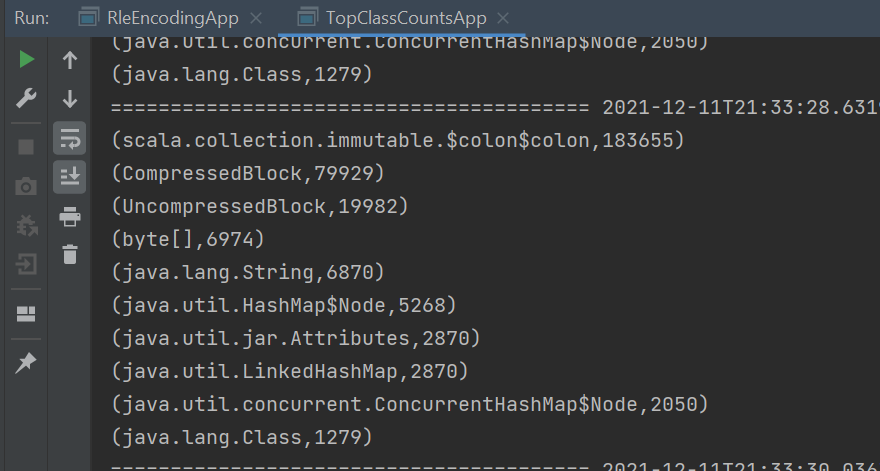
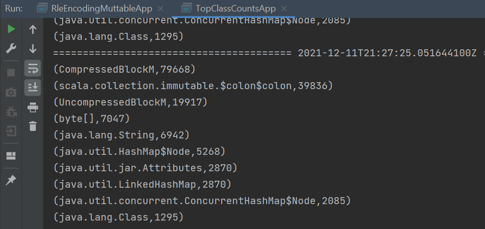
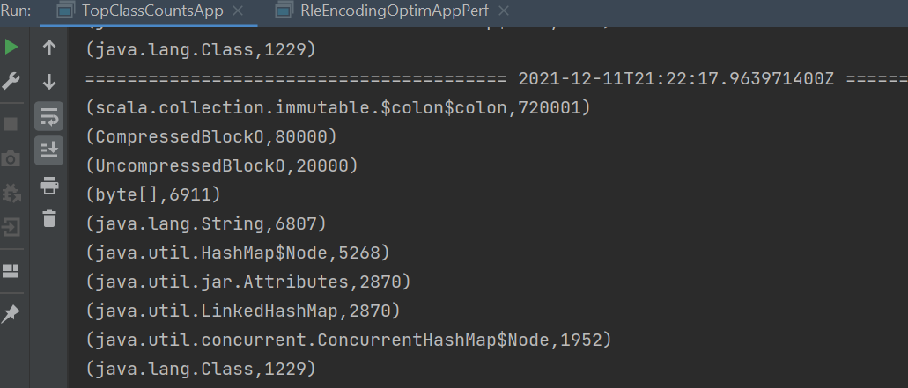
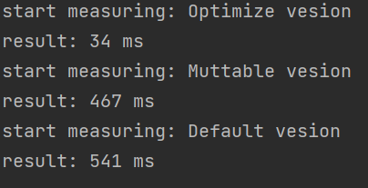
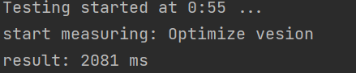

### Задача на оптимизацию RLE-encoding
RleEncoding - изначальных класс
RleEncodingMuttable - класс с использованием мутабельных коллекций
RleEncodingOptim - оптимизированный вариант на иммутабельных коллекциях

#### Замеры количества порождаемых объектов
Тесты запускались на последовательности длиной x10000
RleEncoding:

RleEncodingMuttable:

RleEncodingOptim:

#### Замеры производительности
Тесты запускались на последотельности длиной x1000\

Производительность на последовательности длиной x100000
RleEncodingOptim:

Производительность на последовательности длиной х100000 для других классов не измерялась ввиду их долгой работы